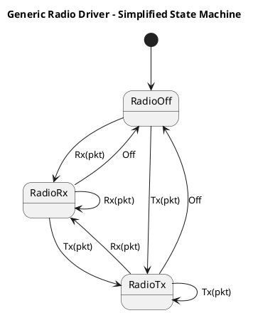
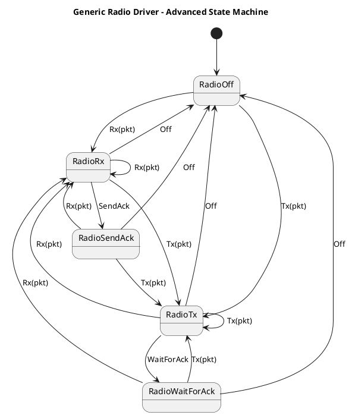
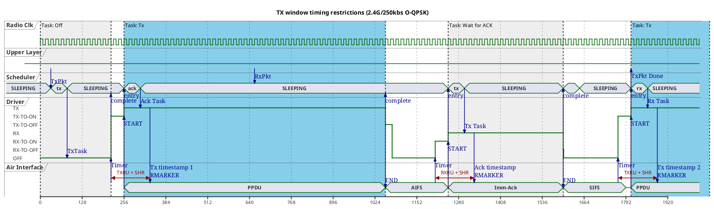

# Towards a generic IEEE 802.15.4 Radio Driver Specification for Rust Frameworks

In the following I am proposing a generic theory of operation and architecture for IEEE 802.15.4 radio drivers embedded in the Rust programming language for use in IEEE 802.15.4 stacks like the dot154d or ieee802154 crates, including their integration into smoltcp, the embassy framework, RTIC or similar.

I start by describing a commonly used model that supports "best effort" full-duplex delivery of packets in FIFO order. Existing IEEE 802.15.4 driver implementations in the Rust language [?] as well as the majority of drivers in open source stacks like Contiki OS, RIoT OS, Linux and the Zephyr OS [?] seem to follow this model.

I then identify additional requirements towards a model supporting hardware-optimized timed reception windows, timed sending of packets as well as other precisely scheduled radio operations. I develop an advanced task-based state machine model and show that such additional sophistication is required in practice to build generic, production-grade drivers that take full advantage of state-of-the-art IEEE 802.15.4 hardware.

Similar ideas are already present in proprietary driver implementations [?] as well as in implementations of other open source radio protocol stacks, most notably the Linux and Zephyr OS Bluetooth stacks [?].

It is, however, required to adapt the task-based driver architecture to the Rust programming language. Direct translation of C-based radio driver stacks into Rust might be possible but would probably not take full advantage of powerful Rust language features.

## Production-grade support for timed protocols

I argue that the "best effort" model is fundamentally incompatible with precise timed reception and delivery. It may be used to establish basic or experimental non-beacon-enabled IEEE 802.15.4 personal area networks (NBE PANs) but cannot implement beacon-enabled PANs (BE PANs) or more sophisticated IEEE 802.15.4 protocols like TSCH, CSL or RIT with sufficient precision, power efficiency and determinism. Most importantly such simplified models cannot take full advantage of hardware offloading and low-power optimizations provided by almost all current IEEE 802.15.4 radio SoCs.

A few examples of use cases that require hardware-backed timed driver operation for full standard compliance and energy efficiency:

- Beacon-enabled PANs require precise synchronization of beacon transmissions, reception timestamps as well as reception and transmission during the contention-free period (CFP).
- CSMA/CA requires precise CCA and start-of-transmission timing.
- CSL is required to support Thread protocol versions 1.2 and later.
- TSCH is required to support IETF deterministic networking based on 6TiSCH.
- TSCH, CSL and RIT (or similar ad-hoc timed protocols) are common in specialized industrial use cases that may not require a full-fledged generic protocol like Thread or 6TiSCH but still need to optimize for battery lifetime or efficient usage of available bandwidth.
- Precision timing is required to support channel sounding and UWB ranging (IEEE 802.15.4z) which again is the basis of the widely deployed FiRa protocol stack (e.g. in recent Android smartphones like the Samsung Galaxy, iPhone or Pixel).

The Rust community has worked around some architectural limitations in the past by providing vendor-, hardware- or sub-protocol-specific abstractions [?]. This, however, seriously limits re-usability of drivers across use cases, applications, network stacks and frameworks, thereby fragmenting community resources and locking applications into specific hardware, software stacks or protocols.

## Static and dynamic correctness guarantees

I believe that existing driver architectures - both those in Rust as well as those inspired by existing C implementations - can be considerably improved in the Rust language by introducing additional statically-validated correctness guarantees together with advanced hardware support.

The complexity of a highly sophisticated driver model further stresses the advantage and necessity of not only enforcing correctness of data structures and interfaces but also locking considerable parts of _dynamic protocol behavior_ into static types (via Rust embeddings of typestates, session types, linear types, abstract state machines, etc.).

Existing implementations of task-based drivers as expressed in the C language are often hard to follow and prove correct. The Rust language offers many opportunities to enforce correctness and rigor of design at compile time combined with improved self-documentation and ergonomics of APIs.

Due to the complexity of timed and hardware-optimized driver logic, I believe that such guarantees should be an essential part of any production-grade radio driver architecture in Rust.

## Architectural differences between the "best effort" and scheduled models

The fundamental advantage of the "best effort" model over any scheduled model is that it can be implemented as an event-driven, reactive component that executes mutually isolated driver operations (herein called driver "tasks") one by one any time after they have been scheduled. Such models may abstract low-level driver operation away in favor of generic "full-duplex packet streams".

This means that such drivers only ever need to be aware of the currently executed task or payload and do not have to care about previous or subsequent tasks or payloads. This isolated model of execution dramatically simplifies driver design and implementation. It has therefore been a common initial choice for IEEE 802.15.4 open source stacks - both in Rust and in C.

While a "full duplex" pair of sequential packet channels continues to be a good abstraction for high-level socket-like communication (OSI 3+) it turns out that additional design sophistication is required to support state-of-the-art IEEE 802.15.4 radio hardware when designing a production-ready IEEE 802.15.4 MAC <-> PHY/Driver interface:

- CPUs interacting with all common radio hardware (radio peripherals or external co-processors) are currently neither fast nor deterministic enough to handle the precise timing requirements of the IEEE 802.15.4 protocol or the even more rigid requirements of state-of-the-art low-energy radio protocol execution.
- Therefore all common radio hardware implements low-level optimizations outside the control of the CPU to ensure deterministic "hard realtime" execution. This includes offloading of MAC-level tasks to hardware or hardware-optimized event infrastructures (peripheral interconnect, interrupts, event-triggered hardware tasks, etc.)
- Such hardware optimizations have to be pre-arranged in advance by the CPU usually concurrently with ongoing radio operations.

To make it worse, current hardware not only automates execution of isolated pre-programmed radio tasks but also requires specific optimization of transitions between _pairs_ of tasks (e.g. fast RX-to-TX and the reverse, hardware-assisted chaining of CCA and TX operations, chaining of RX and ACK sending as well as TX and ACK reception, etc.). This means that driver implementations need to be able to provide different execution paths for each combination of subsequent tasks. This is fundamentally impossible in the "best effort" model which is only ever aware of the currently executed task and therefore cannot pipeline future operations while the current task is still running.

A fundamental shift in driver design is required to support task pipelining:

- **tasks** rather than packets: The link layer scheduler needs to be aware of low-level driver primitives in addition to "packets" or "frames". The driver, on the other hand, knows nothing about upper-layer abstractions unless offloaded to hardware.
- **timed** rather than "best effort": The scheduler provides precise timing instructions to the driver in advance rather than letting the driver autonomously schedule operations at some underspecified point-in-time in the future. Several standard protocols require precise scheduling decisions to be taken at short notice, up to a few µs before task switching actually occurs.
- **active** scheduling (forward control) rather than reactive event execution (inversion of control): The scheduler actively pre-programs the driver in parallel with ongoing task execution rather than the driver reactively and sequentially executing queued operations. This requires the scheduler to peek the next task while the previous task's result is not yet available. Purely sequential queuing (think: "embassy-net-driver-channel") is impossible - even towards the network stack above the link layer.
- **synchronous** rather than asynchronous: Due to limited buffering of hardware peripherals, to support low latency scheduling decisions and to simplify driver implementation, buffering or queueing of tasks between scheduler and driver beyond the next task (1-pipeline) is impossible. Schedulers may only program the next task while the current task is already running. This requires the scheduler to closely synchronize its activities with driver progress.

## Framework policy and migration path

Once a framework depends on a "best effort" driver model, it is very hard to change due to the fundamentally different architecture required for a scheduled model. The driver model defines the API between driver and framework maintainers. Any change to the driver model will therefore have to go through a lengthy deprecation procedure that will hardly succeed in introducing a fundamentally new design as legacy obligations continue to weigh upon it.

In my experience, frameworks starting out with a best effort model, hoping to add on the scheduled model later, will face severe migration issues. The examples of both, Linux and the Zephyr OS, show that such migration will hardly happen as the hurdle to switch from a best effort to a timed model is too high for most community driver maintainers. In Zephyr, only one vendor introduced specific aspects of scheduled RX/TX while all other drivers remain locked into the best effort approach - not even able to support Zephyr's IEEE 802.15.4 flagship protocol Thread 1.2+. This is because the scheduled model was built around single-vendor single-protocol abstractions that don't fit other hardware or sub-protocols well. To my best knowledge there is no scheduling-capable IEEE 802.15.4 driver available in Linux at all.

Understandably, no single vendor or driver maintainer has a fundamental interest in investing into a vendor- or protocol-agnostic glue layer - although - as the examples of Linux, Zephyr and many others show - driver maintainers are usually very open to adapt to a framework's abstractions as they reduce everyone's individual effort even if those abstractions are more sophisticated than what any single maintainer would have introduced on their own.

It is therefore the framework maintainers that have a fundamental interest in providing re-usable glue code early on as this increases the chance of additional contributions by a broader community of independent driver maintainers or vendors.

Unfortunately both, smoltcp/dot154d and embassy, have started out with the "best effort" model. The ieee802154 crate implements important aspects of the scheduled model but not in sufficient generality to support protocols beyond the specific requirements of the UWB PHY that the author seemingly created it for.

Contrary to Linux and Zephyr, though, there are not a lot of Rust legacy drivers that need to be supported or migrated. To my best knowledge only a single nRF52840 driver exists for embassy/smoltcp and only a single Decawave/qorvo driver for ieee802154. These existing drivers can realistically be migrated towards a fully scheduled driver implementation and then serve as examples for future driver maintainers. This seems a minor investment compared to what it unlocks in terms of additional protocol and hardware support.

In my opinion, the largest initial investment is not into migrating existing drivers but into the framework itself. That investment would have to be made anyway to support large parts of the IEEE 802.15.4 standard. It therefore seems to be a good time to introduce the scheduled model into embassy/smoltcp and related projects now - thereby even acquiring an edge over Linux and Zephyr in the specific area of IEEE 802.15.4 communication.

I therefore propose the following migration approach: Embassy/smoltcp should support the scheduled model now while still keeping the initial hurdle to entry for driver maintainers as low as possible, i.e. comparable to the simplified "best effort" approach:

- Traits locking in fundamental data types and scheduled protocol behavior should guide new driver development towards the "right" solution. Such traits are required to abstract tasks and transitions between tasks as explained above.
- Pure software implementations of these traits should be provided as a default adapter between the scheduled and the best effort model. Thereby driver maintainers can start out with only tasks for isolated Radio Off, RX, and TX as in the best effort model. Such default implementations can then be step-by-step be replaced by more sophisticated implementations on an as-needed basis.

# Requirements

I collected the following, non-exhaustive list of requirements to guide framework and driver implementation.

Requirements defining the scope of the proposal:

- **R01.01** The driver model SHALL provide abstractions viable for all SoCs with IEEE 802.15.4 radio hardware already supported by embassy and smoltcp/dot15d4.
- **R01.02** Driver model abstractions SHOULD be viable for as many other IEEE 802.15.4 SoCs available on the market as possible - independently of IEEE 802.15.4 radio PHY (O-QPSK, BPSK, GFSK, SUN, UWB, ...) and band (2.4G, SubG, wideband/chirp, ...).

The driver model SHALL present a minimal barrier to entry while remaining open to highly sophisticated hardware-optimized implementations:

- **R02.01** The driver model SHALL focus on a minimal set of low-level PHY features and thereby remain unencumbered by MAC features as far as possible. MAC features MAY become part of the driver model if (and only if) at least one of the supported SoCs provides hardware offloading for the feature. Typical examples of hardware-backed features currently available on widely used SoCs:
  - features to improve energy efficiency (fast and precise handling of radio ramp-up/tear-down)
  - features to improve standard compliance (fast RX-to-TX switching, fast ACK, inter-frame-space enforcement, etc.)
  - high precision timing of packet sending and receive windows
  - high precision timestamping of incoming and outgoing packets (including sub-ns-precision ranging timestamps on UWB hardware),
  - automatic CCA, CSMA/CA, CRC checking, ACK, etc.
  - automatic resending of packets,
  - hardware-optimized packet encryption, decryption and signing,
  - hardware-optimized packet filtering (PAN, addressing, etc.),
  - MAC/PHY header and information element mangling - e.g. to inject timing-sensitive data on-the-fly (e.g. timestamps to synchronize TSCH networks or specify CSL anchor points)
- **R02.02** Drivers SHALL support at least the following tasks: Radio Off (low-power state), RX (including RX idle), TX (including TX idle). Drivers MAY support the following additional tasks: Send ACK, Wait for ACK.
- **R02.05** The model SHALL provide default software implementations and polyfills for all generic and non-mandatory driver features to ease initial driver development.
- **R02.03** The model SHALL provide hooks to selectively and optionally replace arbitrary generic software features by driver- or vendor-specific implementations that take advantage of proprietary hardware optimizations to improve performance and standard compliance .
- **R02.04** Drivers SHALL be fully functional without providing optimized transitions between pairs of tasks. Drivers MAY individually optimize a transition between any pair of tasks taking full advantage of hardware optimizations (e.g. execution shortcuts, peripheral interconnect, event subsystems, CPU-less integration with other peripherals like clocks or timers, etc.).
- **R02.05** Drivers SHOULD ensure execution within the temporal limits and guard times defined in IEEE 802.15.4 (AIFS, SIFS, LIFS, Turnaround Times, CCA times, etc.) but MAY deviate for practical reasons (e.g. to simplify initial implementation or due to lack of hardware support).

The driver model SHOULD be easy to integrate with embassy applications but should remain independent from the embassy execution model so that it can be used independently of the framework as part of an independent IEEE 802.15.4-backed network stack (e.g. in the dot15d4 or ieee802154 crates). The initial model focuses on asynchronous execution but synchronous blocking or non-blocking implementations SHOULD be easy to derive:

- **R03.01** Abstractions SHALL follow the model of asynchronous execution and SHALL be easy to integrate into the embassy framework.
- **R03.02** Abstractions MAY refer to embassy-specific asynchronous plumbing code including embassy HALs but SHALL limit dependencies to code (crates) that can be used independently of the embassy executor (e.g. with RTIC or other asynchronous execution engines) and network stack (e.g. smoltcp, dot15d4, ieee802154, etc.).
- **R03.03** Implementations SHOULD depend on the embassy HAL but MAY depend on other HALs if a corresponding embassy HAL does not exist.

A few general performance, correctness and safety requirements apply as to any low-level embedded Rust code:

- **R04.01** Abstractions SHOULD be zero-cost wherever possible.
- **R04.02** Abstractions SHOULD statically enforce correct state and behavior wherever possible (e.g. via strong types on state, session types/typestates, linear types, separation of role and state, etc.).
- **R04.03** Abstractions SHOULD be panic-free whenever possible.

Minimal requirements for the best-effort fragment of the overall model:

- **R05.01** The framework SHALL be able to schedule the next driver task while the previous task is still being executed. The framework SHALL NOT schedule more than one task in advance. Default framework glue code SHOULD abstract concurrency away so that initial driver implementations MAY execute isolated tasks.
- **R05.02** Tasks SHALL be executed by the driver precisely in the order they were scheduled. Re-ordering or prioritizing one task over the other (e.g. TX over RX) is NOT part of the driver's responsibilities and SHALL be implemented in upper layers (i.e. in a scheduler component immediately above the driver).
- **R05.03** Reception of packets targeted to the device SHALL not be cancelled mid-frame. Depending on hardware filtering capabilities "targeted" can mean "any packet with the correct SHM", "packets with the correct PAN and addressing" or even "packets with the correct signature and encryption". An already started packet (SHM recognized) takes precedence over sending of packets. (Note: CSMA/CA and other forms of CCA implicitly enforce this rule. In some countries there are even legal requirements to "listen-before-send", e.g. in SubG bands. So drivers cannot make progress towards TX by cancelling active RX anyway.)

Requirements specific to the timed/scheduled fragment of the overall model:

- **R06.01** Each task MAY be assigned a precise start time by upper layers, defined by a single edge of the radio clock. This implicitly allocates an execution window to each task between its own start tick and the start tick of the subsequent task. Tasks that do not have a start time SHALL be executed "as fast as possible" as soon as the previous tasks has finished ("best effort execution")
- **R06.02** Upper layers SHALL ensure that tasks are scheduled in advance respecting protocol- and driver-specific guard times. Upper layers SHALL allocate sufficiently large task execution windows for each task. Drivers SHALL reject tasks that do not respect guard times and execution times.
- **R06.03** If the upper layer does not schedule a subsequent task after the immediate task has been executed then the following rules apply:
  - Radio Off task: The radio is kept in low-power mode.
  - RX task: The radio is kept powered and idle in RX mode (as supported by the hardware) but will ignore any incoming packet.
  - TX task: The radio is kept powered and idle in TX mode (as supported by the hardware) and will ignore any incoming packet.
  - Send ACK task: The radio is kept powered and idle in TX mode (as supported by hardware) and will ignore any incoming packet.
  - Wait for ACK task: The radio is kept powered and idle in RX mode (as supported by hardware) and will ignore any incoming packet.
- **R06.04** Scheduling SHALL be aware of the minimal operation-specific "guard time" required by the driver to update its state, i.e. only such tasks SHALL be accepted that can still be scheduled on-time on the underlying hardware.
- **R06.05** During "radio off" windows, the driver MAY disable the radio and put the peripheral into the lowest possible energy consumption mode. Protocols optimized for battery-supplied devices (Thread, 6TiSCH, etc.) upgrade this requirement to "SHALL".
- **R06.06** Ongoing reception of a frame MAY be continued even if the reception window already ended and the following "radio off" or "send" window started. The model SHALL make this feature configurable so that upper layers MAY control driver behavior in this respect.

Requirements to support non-standard, protocol-specific or vendor-specific extensions:

- **R07.06** Drivers MAY support vendor-specific or non-standard tasks or configuration extensions including corresponding vendor-specific/non-standard scheduler or other upper-layer extensions. Vendor-specific or protocol-specific tasks or extensions SHALL NOT be introduced into the vendor-agnostic API but SHALL be kept in separate files and SHOULD be placed behind feature flags to prove proper encapsulation (API and implementation).
- **R07.07** Upper layers SHALL prove sufficient capacity for handling packets and other operations by presenting the driver with pre-allocated buffers, task structures and any other required resources.

# Driver Tasks

The notion of _radio driver tasks_ is essential to the proposed architecture. Driver tasks compromise between re-usability of drivers by a generic scheduler component while at the same time providing low-level primitives to cater for state-of-the-art radio hardware features.

The IEEE 802.15.4 standard leaves the details of the MAC <-> PHY/Driver interface up to implementors. We therefore remain fully standard compliant, if we identify driver tasks by the following criteria:

1. Tasks need to be large enough (time extension) to be programmable by a CPU - ideally with maximal CPU sleep time in between for best energy efficiency.
2. For best re-use and compatibility of drivers, tasks need to specify generic pieces of work that can be applied to all recent hardware, no matter its vendor-specific capabilities.
3. The task repertoire needed for a minimal working driver should be as small as possible to keep the entry hurdle for community driver maintainers low.

Typical examples of generic (implementation-independent) task primitives are:

- "Send a packet over the air such that it's RMARKER will pass the antenna at the precise radio clock tick T. Encrypt and sign the packet on-the-fly."
- "Ensure that the receiver is on just-in-time so that it'll be able to recognize a packet whose RMARKER is expected to pass the antenna at the precise radio clock tick T +/- X ticks potential clock drift. Keep the receiver on for precisely Y ticks or until an incoming packet is fully received - whatever comes later - and then got to low-energy idle."
- "Use an Enh-Ack to acknowledge the next incoming packet precisely after AIFS - measured as X radio clock ticks. Ensure that it contains a timing header whose timestamp you'll mangle based on the RX timestamp of the preceding packet."
- "Do a CCA of precisely aCcaTime, then - if the channel is idle - immediately send a packet after aTurnaroundTime. If the channel is busy then place the radio in low-energy mode as quickly as possible. Calculate everything such that the RMARKER of the TX packet will pass the antenna at the precise radio clock tick T."

Some SoCs will be able to execute full tasks of the above kind without any CPU intervention. Others will require such tasks to be partially controlled by CPU, again others need them to be implemented in software alone - sometimes with reduced standard compliance (which is good enough for many applications and needs to be supported in practice).

## Minimal set of tasks

Even the simplest driver will have to implement a minimal set of driver tasks to support basic protocol operations.

Based on the above criteria I've identified the following initial tasks that need to be implemented by all drivers - even in the simplest "best effort" scenario:

- Radio Off task: asks the driver to place the radio receiver in a low-power mode for improved energy efficiency
- RX task: asks the driver to enable the radio receiver, contains a buffer to receive a single frame
- TX task: asks the driver to enable the radio transmitter, contains a buffer with the frame to be sent

"Radio Off" is modeled as a task in its own right rather than being defined as the "absence" of other tasks:

- I propose to model the radio driver state machine entirely around tasks, i.e. tasks are just state machine states. Defining a radio off _state_ then automatically requires existence of a corresponding _task_.
- It turns out that low-energy protocols require sleep periods to be defined as precisely scheduled time windows just as RX or TX windows.
- The scheduling API is simplified if all radio states can be scheduled in the same way.

Note that CSMA/CA requires control of isolated CCA operations with potentially long subsequent backoff periods. With ~~distinct CCA and~~ non-deterministic TX tasks, such backoff periods can be modeled generically across drivers as "Radio Off" fallback tasks if executing a TX tasks fails due to CCA busy.

~~Introducing an own task primitive for CCA allows to keep algorithms like CSMA/CA, TSCH CCA, etc. in the shared framework while still letting drivers selectively optimize CCA/TX transition pairs if available in hardware.~~

UPDATE: Performance testing showed that CCA is too short on 2.4G O-QSPK for the CPU to keep up. So I had to make CCA a part of the TX task. Non-deterministic task outcomes were introduced instead to allow CSMA/CA, TSCH CCA, etc. to be part of the framework.

## Advanced set of tasks

A more advanced set of generic tasks also contains:

- Send ACK: asks the driver to send an immediate or enhanced acknowledgement frame (Imm-Ack or Enh-Ack) in response receiving a frame as part of an Rx task.
- Wait for ACK: asks the driver to wait (with timeout) for an Imm-Ack or Enh-Ack after a Tx tasks finishes.

Of course, "Send ACK" can also be modeled as a "Tx task" and "Wait for ACK" as an "Rx task". And that's exactly what is proposed for the simplified driver model. It turns out, though, that several vendors have built in support for either automated acknowledgement or sophisticated mangling of ACK frames (e.g. to insert sequence numbers or timing-critical information at runtime).

This is the case as the time between a payload frame and the corresponding acknowledgment frame can be so short for some PHYs, that the SoCs CPU component will have a hard time to keep up. And as a frame/ACK pair always requires a TX-to-RX turnaround (or the inverse), optimizing for energy efficient execution is also important. Waking the CPU for an acknowledgement wastes energy in itself but also means that powering down the radio between frames may be delayed or could not be done at all.

Having separate ACK tasks and corresponding state machine states, lets drivers selectively take advantage of all such optimizations without introducing additional runtime checks (logical forks). Runtime checks and the corresponding increased cyclomatic complexity need to be avoided as they cannot be statically verified by procedural typing.

## Behavioral modeling of task transitions

The simplified model can be evolved towards the advanced model once drivers start to optimize transitions between tasks, e.g. hardware-accelerated RX-to-TX/Off and TX-to-RX/Off switching. In the production-grade model, the actual driver primitive is therefore not each task in isolation but each _pair_ of tasks.

Not all pairs of tasks make sense in practice, e.g. chaining "Send ACK" and "Wait for ACK" will not be required. All combinations of transitions to be supported can be looked up in the UML state machine models below.

In Rust, making use of the typestate pattern, it is easy and highly efficient to implement different code paths depending on runtime state while also statically proving overall behavioral correctness. I propose that we take full advantage of Rust language features to enforce correct implementation of individual task transition pairs.

This may seem excessively verbose or complex initially, but in my experience code that decides upon per-transition optimizations at runtime, will quickly get even more complex and above all much harder to get right and test.

Apart from that, scheduler implementation becomes much more expressive and safe when done in terms of static state representations. Trying to take execution paths that are not supported by the state machine, will immediately result in compile-time errors.

In combination with Rust variants, any typestate representation of a state machine can easily be converted into a corresponding runtime representation and back. So if there is potential for simplification by expressing runtime conditions on states (e.g. in the scheduler), then we'll still be able to take full advantage of such representations without loosing any of the typestate pattern's expressiveness and guarantees.

Communicating state machines expressed as typestates also open up opportunities for further linear programming and advanced protocol modeling with session types. These techniques can also be applied based on basic typestates where required.

Summarizing: The foundational model of the driver and scheduler will be abstract communicating state machines. Scheduler/driver communication protocols will be further be refined in terms of typestates, session types and linear programming where appropriate. These are all well-defined rigid modeling techniques that even open up the possibility to formally verify parts of the implementation where required.

# Task timing

## Simplified timing

The simplified model allows drivers to execute tasks "as fast as possible" as they arrive.

As typical delays can often be measured per driver with acceptable jitter given some well-defined execution environment, such an approach is often good enough for basic protocol compliance.

As the software implementation of isolated tasks is so much simpler than the hardware-optimized implementation of a much larger number of transitions (pairs of tasks), such a simplified implementation should be "good enough" for simple drivers to initially just work.

All tasks therefore exist in a "best effort" version. Knowing driver-specific delays, schedulers will schedule such tasks just-in-time for the driver to pick them up and execute them reactively.

Note: Even in a sophisticated timed model there are applications for tasks without pre-calculated timing. Tasks often need to be executed "immediately after" some previous task of unknown length. If "best effort" is replaced with some well-defined relative inter-task timing, we get precise timing even if the exact point in time of some task cannot be deterministically calculated in advance.

Examples:

- acknowledgement
- sending or receiving several frames "as fast as possible"
- responses to commands
- ...

## Advanced timing

Let's now make the timing precise for all tasks in the advanced model to achieve state-of-the art protocol compliance and above all energy efficiency.

### The importance of RMARKERs in advanced timing

Central to timed RX/TX is the notion of the "RMARKER" or equivalently "start of physical header (PHD)", "end of synchronization header (SHR)" or "the beginning of the symbol following the start-of-frame (SFD) delimiter".

The most precise definition of the RMARKER is given in IEEE 802.15.4-2020z, section 6.9.1.1. This definition subsumes and replaces all other definitions given in different protocol contexts or prior versions of the standard:

"For all PHYs the RMARKER is defined to be the time when the beginning of the first symbol following the SFD of the frame is at the local antenna."

This is the exact point in time that any RX/TX timestamp designates relative to the local radio clock. Any offsets to this definition (e.g. due to hardware guard times or signal times between the SoC and the antenna) need to be taken into account and corrected for internally by driver implementations.

Any window widening or timestamp adjustment required to cater for local or remote clock drift or global clock synchronization SHALL be calculated by the client. It is the driver's sole responsibility to schedule radio operations as precisely as possible according to its local radio clock.

Clients MAY adjust timing calculations based on transmission and reception timestamps provided by the radio driver (e.g. comparing expected and actual reception times to derive clock drift relative to a peer device's radio clock).

The driver SHALL communicate a guard time to the client. This is the max. time required by the driver after scheduling a timed reception or transmission to ramp up the radio, start reception or transmission until emitting the RMARKER. I.e. the guard time determines the latest possible time at which a client may schedule a window relative to the window's RMARKER timestamp.

### Specification of task timing

The following re-definition of the tasks already mentioned above is required to make their timing precise:

- RX task: a precisely defined time window during which the radio receiver SHALL be able to recognize and receive incoming packets.
- TX task: a period with a precise start time during which a given packet SHALL be sent if (and only if) potential TX predicates are true (e.g. successful prior CCA).
- RadioOff task: a precisely defined time window during which the radio peripheral SHALL be placed into a minimal energy consumption state (no RX/TX).
- Send ACK tasks: either a precisely timed "immediate" response to a frame received within an Rx task or a specialized send window timed in the same way as a Tx window (e.g. in slotted operation)
- Wait for ACK tasks: either a precisely timed "immediate" reception window with timeout placed after a Tx task or a separately timed Rx window specialized to ACK operation

Timed tasks may contain the following data:

- a sufficiently precise (in protocol / energy efficiency terms) timestamp that determines an RMARKER relative to the local monotonic and overflow-protected radio clock, either given in (parts of) nanoseconds or in symbols.
  - The significance of the timestamp depends on the task type.
  - In case of RX tasks, the timestamp points to the expected earliest RMARKER at
    which a packet is to be expected at the local antenna.
  - In case of TX tasks, the timestamp points to the time at which the RMARKER of the packet SHALL pass the local antenna, drivers SHALL account for CCA time if CCA is requested.
  - In case of Radio Off tasks, the timestamp points to the earliest time at which detection of new packets is no longer required (i.e. any packet with an earlier RMARKER SHALL still be detected in a preceding RX window).
- for RX tasks:
  - an associated zero-copy mutable packet buffer
  - any hints regarding hardware offloading features (decryption/signing context, CRC parameters, packet filtering, etc.)
- for TX tasks:
  - an associated zero-copy mutable packet buffer - mutability is required for certain last-minute patches offloaded to hardware
  - hints regarding the CCA mode to be employed (see section 10.2.8)
  - any hints regarding hardware offloading features (CRC parameters, encryption or signing, header mangling, etc.),
- for ACK tasks:
  - hints regarding timing and content of automatic Ack (Imm-Ack vs. Enh-Ack, information elements, Ack after AIFS vs. at a backoff period boundary, etc.) if supported by the driver (see section 6.7.4.3)
- for RadioOff windows:
  - hints regarding the low-energy-state to be reached

Note that clock drift is an important factor, but it is assumed that the scheduler takes the responsibility to calculate guard times for clock drift and sets timestamps accordingly. Drivers should not have to deal with drift calculations.

Also note that end-timestamps are not given. The end of one task is defined by the start of the next tasks. Schedulers need to ensure that the minimal and maximal execution time of the previous task is always allowed for when scheduling new tasks. Therefore drivers can simply reject tasks with a non-recoverable error if they cannot be scheduled in time without having to abort the previous task. This allows for flexible ad-hoc scheduling of tasks while keeping driver implementations as simple as possible:

- All tasks end by the subsequent task's start timestamp less appropriate hardware-specific guard times. If no subsequent task has been scheduled then tasks are defined to take "forever", i.e. the radio remains in the state that it was left by task execution ("off" for Radio Off, TX/RX idle for all other tasks). This allows the scheduler to deal with situations when the details of the next task are not yet known but it is known that the next task will be of a certain kind (e.g. it may be required to keep the receiver on for fast scheduling of another RX task without long ramp-up times).

It is the scheduler's responsibility to ensure that standard-defined guard times (AIFS, SIFS, LIFS, aTurnoverTime, aCcaTime, etc.) will be respected. The driver may check such conditions and reject offending tasks with a non-recoverable error.

Note that this may even have regulatory relevance: CCA, for example, must be executed for some minimal time for protocol compliance (see aCcaTime, section 11.3, table 11-1) plus any additional energy detection due to regulatory compliance (see section 10.2.8).

Initially, while no task is scheduled at all, an immediate "RadioOff" task is assumed to be active indefinitely.

### "Immediate" tasks in the advanced model

As already mentioned, "best effort" task execution will be defined more precisely in the timed model. Packets scheduled with a special "best-effort" timestamp value will be executed "immediately" after the preceding task with a task specific precise timing for full standard compliance:

- RX and Radio Off tasks SHALL be ended immediately after receiving a subsequent "best-effort" TX, RX or RadioOff task unless the receiver is currently receiving a frame targeted to the current device. In the latter case the next tasks will be executed immediately after finishing packet reception.
- TX tasks will be fully executed before switching to execute any subsequently scheduled "best effort" RX or "radio off" task. Drivers MAY implement fast hardware-supported Tx-to-RX/Off switching in this case.

In the above "immediately" means "as fast as possible modulo guard times imposed by hardware delays or standard inter-frame-spacing rules".

# The state machine model

As a first design approach I present state machine diagrams that document the transition from a "best effort" towards a more sophisticated "scheduled" approach.

## Minimal state machine for best-effort reception and delivery of packets

The simplified model defines the minimal interface drivers will initially have to implement. Drivers implement isolated Radio Off, RX and TX states. Transitions between states as well as acknowledgments are implemented in software. Tasks are "best effort", i.e. timestamps will not be assigned by the scheduler: The driver will execute tasks "as fast as possible" once they have been scheduled.

The best-effort scheduler will generate Rx or Tx tasks whenever a new RX/TX packet buffer (=RX/TX token) becomes available through the next upper layer. The scheduler keeps the driver in "Radio Off" state while no reception or transmission needs to be scheduled.

The driver asynchronously signals task results when the scheduled packet has been received or was sent.

## Advanced hardware-optimized state machine for timed reception and delivery of packets

Two additional tasks and corresponding states will be defined for the advanced state machine: Send ACK and Wait for ACK. Additionally, the advanced state machine imposes restrictions on the scheduling and timing of transitions.

# Example 1: Driver Timing

The following example will hopefully make some of the concepts easier to grasp and see how they work together in practice.

I exemplify timing based on the 2.4G O-QPSK PHY which demands a 250kbs data rate (section 12.2.2). A single data octet is encoded by two symbols (section 12.2.4).

I further assume a hardware model similar to that of the nRF SoC series as this is a model that many are familiar with. But the example is of course still transferable to other hardware. I'll use precise hardware-specific guard times of the nRF52840 to make the example more practically relevant.

Let's collect some important parameters from the spec and hardware data sheets required to calculate timings.

## PHY-specific timing parameters

The symbol rate in 2.4G O-QSPK is (250k / 8) \* 2 = 62.5k symbols per second. Or alternatively a **symbol period of 16µs**.

The PHY's protocol data unit (PPDU) consists of a synchronization header (SHR), the PHY header (PHR) and the PHY payload which contains the MAC frame (MAC protocol data unit, MPDU).

In case of the O-QPSK PHY, the **SHR** consists of a preamble (4 octets, 8 symbols, 128µs) and the **start-of-frame delimiter** (SFD, 1 octet = 2 symbols, 32µs), see section 12.1.2.

The **PHR** consists of a single octet (2 symbols, 32µs).

Depending on the frame type and length, required inter-frame spacing (IFS) between transmitted frames is as follows (sections 6.2.4 and 6.7.4.3):

- Turnaround time: **12 symbol periods** for O-QPSK (aTurnaroundTime, min. time required to switch from RX to TX or reverse, see section 11.3, table 11-1)
- short IFS (SIFS) after MPDUs <= 18 octets: **12 symbol periods** for O-QPSK ( see sections 10.1.4 and aMaxSifsFrameSize 8.4.2, table 8-93)
- long IFS (LIFS) after MPDUs > 18 octets: **40 symbol periods** for O-QPSK (ibid.)
- ACK IFS (AIFS): **12 symbol periods** for O-QPSK (same as SIFS, see section 6.7.4.3)

Similar definitions apply to other PHYs. Therefore the following timing examples need to be adapted for other PHYs but will structurally remain the same.

## Hardware-specific timing parameters

Driver implementations have to cater for hardware-specific ramp-up and tear-down times.

In the case of the nRF52840 these are (nRF52840 PS, sections 6.20.15.8 and 6.20.15.10):

- RXEN/TXEN->READY: 40µs +/- 0.25µs (fast ramp-up)
- TX: DISABLE->OFF: max. 21µs
- RX: DISABLE->OFF: max. 0.5µs
- RX-to-TX/TX-to-RX turnaround: ~40µs

## Task timing example.

Example: Radio is initially off

Next Upper Layer:

- queues a TX packet into to the scheduler's TX queue.

Scheduler:

- calculates a PSDU/MPDU of 18 bytes (TX packet 16 bytes + 2 bytes FCS),
- allocates a Tx task and calculates the packet's desired RMARKER in terms of the local radio clock as "Tx timestamp 1",
- transmits the timestamped Tx task to the driver with sufficient guard time as required by the driver's configuration.

Driver:

- sets the radio peripheral's Tx DMA pointer to the start of the PPDU in the Tx task,
- calculates the hardware specific time to ramp up the radio,
- calculates the PHY specific time required to send the synchronization header (SHR),
- configures and arms a timer to fire at time "Tx timestamp/RMARKER - SHR send time - Tx ramp up time",
- configures the timer interrupt to trigger the "on-complete" action of the "Radio Off" state machine state,
- configures the timer event to trigger the vendor-specific TX ramp-up task,
- configures the vendor-specific "Tx ready" event to trigger the vendor-specific "Tx start" task,
- configures the "START" interrupt to trigger the "on-entry" and "on-do" actions of the "Tx" state machine state,
- configures the "END" event to trigger the "on-complete" action of the "Tx" state machine state.

The "on-entry" action of the Tx task signals to the scheduler that the driver is ready to accept scheduling of the next task.

Scheduler:

- allocates a "Wait for ACK" task,
- calculates the earliest possible RMARKER timestamp of the expected ACK frame allowing for the measured clock drift between the local and the remote device as "Tx Timestamp/RMARKER + PHR send time + MPDU send time + AIFS - (local clock drift \* PPDU length) - (remote clock drift \* AIFS length)",
- transmits the timestamped Wait for ACK task to the driver with sufficient guard time as required by the driver's configuration.

Driver:

- calculates the minimum time to ramp-down the radio and ramp it back up in RX mode
- depending on the result: decides to temporarily disable the receiver
- sets the radio peripheral's Rx DMA pointer to a buffer that will receive the acknowledgement frame,
- configures and arms a timer to fire at time "ACK timestamp/RMARKER - SHR receive time - RX ramp up time",
- configures the timer event to trigger the vendor-specific RX ramp-up task,
- configures the vendor-specific "Rx ready" event to trigger the vendor-specific "Rx start" task,
- configures the "START" interrupt to trigger the "on-entry" and "on-do" actions of the "Wait for ACK" state machine state,
- configures the "END" event to trigger the "on-complete" action of the "Wait for ACK" state machine state.
- configures and arms a timeout timer signalling a "no ACK" situation,
- etc.

PHY specific timing parameters (see above):

- PPDU: SHR 5 octets + PHR 1 octet + MPDU 18 octets = **50 symbol periods**
- AIFS = SIFS = aTurnaroundTime: **12 symbol periods** (MPDU <= 18 octets)
- LIFS: **40 symbol periods** (MPDU > 18 octets)
- Imm-Ack: SHR 5 octets + PHR 1 octet + MPDU 5 octets = 11 octets = **22 symbol periods**
- clock drift compensation: 2\*{drift in ppm}\*{time since last clock sync} = assuming max. **1 symbol period** in my example

# Example 2: Scheduling CSMA/CA

As a second example let's take unslotted CSMA/CA random access w/o PCA (section 6.2.5.1) with the following default parameters applicable to the 2.4G O-QPSK PHY.

- macMinBE: **3** (section 8.4.3.1, table 8-94)
- macMaxBE: **5** (ibid.)
- macMaxCsmaBackoffs: **4** (ibid.)
- aTurnaroundTime: **12 symbol periods** (section 11.3, table 11-1)
- aCcaTime: **8 symbol periods** (ibid.)
- aUnitBackoffPeriod: aTurnaroundTime + aCcaTime

The maximum CSMA/CA backup time that can still lead to a successful transmission is:

- max. number of CSMA/CA rounds multiplied with the max. time per CSMA/CA round

The max. number of CSMA/CA rounds:

- macMaxCsmaBackoffs + 1 = 5

The max. time per CSMA/CA round for the 2.4G O-QPSK PHY:

- max. random delay: (2^BE-1) \* aUnitBackoffPeriod = (2^BE-1) \* 320µs where BE is macMinBE initially and min(BE+1, macMaxBE) subsequently, see section 6.2.5.1
- aCcaTime: 128µs
- driver-specific CPU time for CSMA/CA loop control: in the order of a few cycles per CSMA/CA round if well implemented, let's say 2µs in my example

This yields the max. time for each round as follows:

- Round 0: BE=3, 2^BE-1=7, max. delay=7\*320µs=2240µs, incl. CCA/CPU: **2370µs**
- Round 1: BE=4, 2^BE-1=15, max. delay=15\*320µs=4800µs, incl. CCA/CPU: **4930µs**
- Rounds 2-5: BE=5, 2^BE-1=31, max. delay=31\*320µs=9920µs, incl. CCA/CPU: **10050µs**

These timings show, that CSMA/CA cannot be treated efficiently inside timed TX tasks alone. This explains the proposed CCA task which can be interleaved with TX, RX and RadioOff tasks to concurrently listen for incoming packets or support low-energy operation during CSMA/CA backoff periods.
