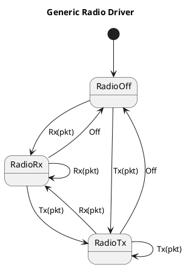
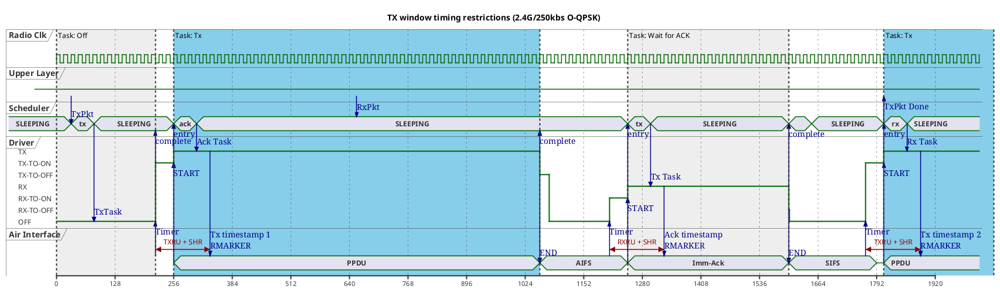

# Towards a generic IEEE 802.15.4 Radio Driver Specification for Rust

The dot15d4 framework is based on a generic theory of operation and architecture for IEEE 802.15.4 radio drivers with precision timing and generic hardware offloading support. The goal is to make it easy for open source driver contributors to provide and maintain truly production-grade drivers with minimal effort and potential for error.

## Production-grade framework support for timed protocols and hardware offloading

Most existing IEEE 802.15.4 driver APIs don't support precise scheduling and timing of radio tasks at all. Such driver APIs may be easy to implement but on real hardware they systematically fail to conform to timing requirements defined in the standard (e.g. inter-frame spacing or precision timestamping or scheduling of TX and/or RX windows). This is true for all currently existing open source IEEE 802.15.4 driver APIs in the Rust language [1] and even for the Linux IEEE 802.15.4 driver API.

Also, existing driver APIs will often not generically support offloading of MAC tasks (IFS enforcement, ACK, filtering, CRC, security, timing-critical IE and header updates, etc.) to transceivers that implement these concerns in hardware while still being able to fill in cross-driver, framework-provided software implementations for hardware that doesn't have the corresponding MAC acceleration capabilities. The few non-Rust APIs that do support precise timing and hardware acceleration force each individual driver maintainer to re-implement such concerns in driver- or vendor-specific code even if much of it could be implemented generically and shared above the driver level. Even APIs in well-known open source stacks like Contiki OS [2], RIoT OS [3] or Zephyr [4] are no exception to this rule.

This makes addition of new drivers and maintenance of existing drivers unnecessarily complex, costly and error prone from a maintainer perspective. In the case of Zephyr, for example, maintaining fully compliant IEEE 802.15.4 drivers is so involved that at the time of writing, not a single fully compliant driver had been contributed by individual community members. Only two large vendors were able to provide production-grade drivers for their hardware whose development and maintenance requires them to employ dedicated development teams.

The dot15d4 framework tries to fix this situation by introducing a novel paradigm into IEEE 802.15.4 driver API design. While existing drivers invariably abstract around some flavor of state-agnostic `send()` and `receive()` methods, the dot15d4 driver API enforces a much lower-level state machine with distinct, asynchronous transitions between Off, Rx and Tx states. Driver maintainers will only have to implement low-level transitions between radio states without having to drive the state machine themselves.

To avoid misunderstanding: Similar low-level state machine APIs already exist _within_ any reasonable production-grade radio driver. They also exist for other radio protocols, e.g. in the Linux and Zephyr Bluetooth stacks. What distinguishes the dot15d4 approach is that it defines a _shared, generic_ state machine design to be re-used _across_ drivers independently of vendor and radio protocol.

Based on such a low-level state machine, the framework will now be able to hide most of the complexity: edge cases and error conditions can be handled correctly and consistently across all drivers. At the same time it is this low-level control over radio state that allows the framework to implement and share common soft-MAC procedures across drivers in case a SoC doesn't implement e.g. ACK offloading, filtering or CRC checking in hardware while maintaining full standard compliance. Its low-level state-machine abstraction allows dot15d4 to pre-program radio transitions ahead of time not requiring any CPU involvement on timing-critical execution paths. Even generic intra-frame interaction with the driver is possible, e.g. to validate and filter frame headers while the remainder of the frame is still being received.

In contrast to this, state-agnostic send/receive-style APIs force driver maintainers to implement the complex and error prone logic driving the radio state machine and timing-critical soft-MAC features (like auto-ACK or frame validation and filtering) inside the driver to achieve full standard compliance: The send/receive abstraction requires CPU involvement _between_ radio tasks (i.e. between `send()` and `receive()` calls) thereby standing in the way of any hard real-time guarantees above the driver API level.

Send/receive-style driver APIs supporting at least limited precision timing exist but systematically break encapsulation and therefore invariably burden driver implementations with unnecessary complexity and redundancy. This is true for proprietary drivers and open source drivers alike. To work around API limitations, Zephyr radio drivers, for example, currently require MAC frame parsers and writers as well as deep knowledge of CSL anchor point calculation _inside each individual driver_ to maintain standard compliance. In Zephyr, adding support for additional protocols like RIT, TSCH or beacon-enabled PANs requires large changes across _all_ drivers. This is a no-go for any open source framework expecting driver contributions from individual community members while maintaining consistent behavior across vendors.

## Painless driver development with compile-time correctness guarantees

Transitions between radio states require vendor- and transition-specific hardware scheduling without CPU intervention. This is necessary to enforce the hard real-time requirements of standard-compliant inter-frame spacing and high-precision RX/TX scheduling and timestamping. This is true for all currently available IEEE 802.15.4 radio SoCs and transceivers on the market. Therefore all existing production-grade drivers had to implement the kind of transitions exposed in dot15d4's radio API anyway.

A few examples of use cases that require hardware-backed real-time operation for full standard compliance and energy efficiency:

- Beacon-enabled PANs require precise synchronization of beacon transmissions, reception timestamps as well as reception and transmission during the contention-free period (CFP).
- CSMA/CA requires precise CCA and start-of-transmission timing.
- CSL is required to support Thread protocol versions 1.2 and later.
- TSCH is required to support IETF deterministic networking based on 6TiSCH.
- TSCH, CSL and RIT (or similar ad-hoc timed protocols) are common in specialized industrial use cases that may not require a full-fledged generic protocol like Thread or 6TiSCH but still need to optimize for battery lifetime or efficient usage of available bandwidth.
- Precision timing is required to support channel sounding and UWB ranging (IEEE 802.15.4z) which again is the basis of the widely deployed FiRa protocol stack (e.g. in recent Android smartphones like the Samsung Galaxy, iPhone or Pixel).

Exposing low-level state transitions to a well-defined shared API therefore doesn't increase driver development effort. Much to the contrary, it simplifies production-grade driver design and implementation considerably: getting the mandatory state machine right will be much easier from a driver maintainer's viewpoint, especially for new drivers. Correctness and standard-compliance can now be proven, enforced and maintained across all drivers at compile time. In dot15d4 this is done via strongly typed, cross-driver typestates.

In Rust typestates, session types and simulation of linear types allows us to lock considerable parts of _dynamic protocol behavior_ into static types along with improved self-documentation and ergonomics of the API. In contrast, existing implementations of task-based drivers as expressed in the C language are often hard to follow and prove correct.

## Capabilities beyond IEEE 802.15.4

The dot15d4 driver design will not only guarantee IEEE 802.15.4 standard compliance of drivers but also unlocks additional capabilities for research into novel high-precision timing and radio scheduling approaches beyond the standard. Plus it is generic enough to also implement other radio protocols. It would for example be entirely possible to implement a generic bt-hci compatible Bluetooth controller above dot15d4's low level driver API, thereby dramatically reducing controller implementation effort for new or existing hardware in Rust.

## References

[1] See e.g. https://docs.rs/radio/latest/radio/, https://github.com/embassy-rs/embassy/blob/main/embassy-nrf/src/radio/ieee802154.rs or https://github.com/tweedegolf/lr-wpan-rs/blob/main/lr-wpan-rs/src/phy.rs
[2] https://github.com/contiki-os/contiki/blob/master/core/dev/radio.h
[3] https://github.com/RIOT-OS/RIOT/blob/master/drivers/include/net/netdev.h
[4] https://github.com/zephyrproject-rtos/zephyr/blob/main/include/zephyr/net/ieee802154_radio.h

# The dot15d4 Radio Driver Model

The classic send/receive radio driver model is attractive from a framework developer viewpoint. It conceives radio drivers as event-driven, reactive components that execute mutually isolated driver operations (herein called driver "tasks") one by one "as fast as possible" after they have been scheduled by the framework. Frameworks based on a send/receive driver model only ever need to be aware of the currently executed task or payload and do not have to care about previous or subsequent tasks or payloads. Timing restrictions across distinct radio tasks are abstracted away and ignored, in most cases simply assuming that CPUs will be "fast enough" to stay within limits. Based on such a model, frameworks may abstract low-level driver operation away in favor of high level "full-duplex packet streams".

This model of execution dramatically simplifies framework design and implementation. This probably explains its popularity in both Rust and C despite its obvious downsides.

While a "full duplex" pair of sequential packet channels continues to be a good abstraction for high-level socket-like communication (OSI 3+) it turns out that additional design sophistication is required to support state-of-the-art IEEE 802.15.4 radio hardware when designing a production-ready IEEE 802.15.4 MAC <-> PHY/Driver interface:

- CPUs interacting with all common radio hardware (radio peripherals or external services) are currently neither fast nor deterministic enough to handle the precise timing requirements of the IEEE 802.15.4 protocol or the even more rigid requirements of state-of-the-art low-energy radio protocol execution.
- Therefore all common radio hardware implements low-level optimizations outside the control of the CPU to ensure deterministic "hard realtime" execution. This includes offloading of MAC-level tasks to hardware or hardware-optimized event infrastructures (peripheral interconnect, interrupts, event-triggered hardware tasks, etc.)
- Such hardware optimizations have to be pre-arranged in advance by the CPU usually concurrently with ongoing radio operations.

To make it worse, current hardware not only automates execution of isolated pre-programmed radio tasks but also requires specific optimization of transitions between _pairs_ of tasks (e.g. fast RX-to-TX and the reverse, hardware-assisted chaining of CCA and TX operations, chaining of RX and ACK sending as well as TX and ACK reception, etc.). This means that driver implementations need to be able to provide different execution paths for each combination of subsequent tasks. This is fundamentally impossible in the "best effort" model which is only ever aware of the currently executed task and therefore cannot pipeline future operations while the current task is still running.

A fundamental shift in driver design is required to support task pipelining:

- **tasks** rather than packets: The link layer scheduler needs to be aware of low-level driver primitives in addition to "packets" or "frames". The driver, on the other hand, knows nothing about upper-layer abstractions unless offloaded to hardware.
- **timed** rather than "best effort": The scheduler provides precise timing instructions to the driver in advance rather than letting the driver autonomously schedule operations at some underspecified point-in-time in the future. Several standard protocols require precise scheduling decisions to be taken at short notice, up to a few µs before task switching actually occurs.
- **active** scheduling (forward control) rather than reactive event execution (inversion of control): The scheduler actively pre-programs the driver in parallel with ongoing task execution rather than the driver reactively and sequentially executing queued operations. This requires the scheduler to peek the next task while the previous task's result is not yet available. Purely sequential queuing (think: "embassy-net-driver-channel") is impossible - even towards the network stack above the link layer.
- **isochronous** rather than asynchronous: Due to limited buffering of hardware peripherals, to support low latency scheduling decisions and to simplify driver implementation, buffering or queueing of tasks between scheduler and driver beyond the next task (1-pipeline) is impossible. Schedulers may only program the next task while the current task is already running. This requires the scheduler to closely synchronize its activities with driver progress.

## Framework policy and migration path

Once a framework depends on a send/receive driver model, it is very hard to change due to the fundamentally different architecture required for a scheduled/pipelined model. The driver model defines the API between driver and framework maintainers. Any change to the driver model will therefore have to go through a lengthy deprecation procedure that will hardly succeed in introducing a fundamentally new design as legacy obligations continue to weigh upon it.

Frameworks starting out with a send/receive model, hoping to add on timing and scheduling features later, will face severe migration issues. The examples of both, Linux and the Zephyr OS, show that such migration will hardly happen as the hurdle to switch from a send/receive to a pipelined model is too high for most community driver maintainers. In Zephyr, only two large vendors introduced specific aspects of scheduled RX/TX while all other drivers remain locked into the send/receive approach - not even able to support Zephyr's IEEE 802.15.4 flagship protocol Thread 1.2+. This is because the scheduled model was built around single-vendor single-protocol abstractions that don't fit other hardware or sub-protocols well. To my best knowledge there is no scheduling-capable IEEE 802.15.4 driver available in Linux at all.

Understandably, no single vendor or driver maintainer has a fundamental interest in investing into a vendor- or protocol-agnostic glue layer - although - as the examples of Linux, Zephyr and many others show - driver maintainers are usually very open to adapt to a framework's abstractions as they reduce everyone's individual effort even if those abstractions are more sophisticated than what any single maintainer would have introduced on their own.

It is therefore the framework maintainers that have a fundamental interest in providing re-usable glue code early on as this increases the chance of additional contributions by a broader community of independent driver maintainers or vendors.

Contrary to Linux and Zephyr, there are not a lot of Rust legacy drivers that need to be supported or migrated. To my best knowledge only a simple nRF52840 driver exists for embassy/smoltcp and an even simpler one inside the nrf hal crate. A Decawave/qorvo driver exists for lr-wpan-rs. These drivers can realistically be migrated towards a fully scheduled driver implementation and then serve as examples for future driver maintainers: Traits locking in fundamental data types and scheduled protocol behavior guide new driver development towards the "right" solution. Such traits abstract tasks and transitions between tasks as explained above.

## Driver API Requirements

I collected the following, non-exhaustive list of requirements to guide framework and driver implementation.

Requirements defining the scope of the proposal:

- **R01.01** The driver model SHALL provide abstractions viable for all SoCs with IEEE 802.15.4 radio hardware already supported by embassy and smoltcp/dot15d4.
- **R01.02** Driver model abstractions SHOULD be viable for as many other IEEE 802.15.4 SoCs available on the market as possible - independently of IEEE 802.15.4 radio PHY (O-QPSK, BPSK, GFSK, SUN, UWB, ...) and band (2.4G, SubG, wideband/chirp, ...).

The driver model SHALL present a minimal barrier to entry while remaining open to highly sophisticated hardware-optimized implementations:

- **R02.01** The driver model SHALL focus on a minimal set of low-level PHY features and thereby remain unencumbered by MAC features as far as possible. MAC features MAY become part of the driver model if (and only if) at least one of the supported SoCs provides hardware offloading for the feature. Typical examples of hardware-backed features currently available on widely used SoCs:
  - features to improve energy efficiency (fast and precise handling of radio ramp-up/tear-down)
  - features to improve standard compliance (fast RX-to-TX switching, fast ACK, inter-frame-space enforcement, etc.)
  - high precision timing of packet sending and receive windows
  - high precision timestamping of incoming and outgoing packets (including sub-ns-precision ranging timestamps on UWB hardware),
  - automatic CCA, CSMA/CA, CRC checking, ACK, etc.
  - automatic resending of packets,
  - hardware-optimized packet encryption, decryption and signing,
  - hardware-optimized packet filtering (PAN, addressing, etc.),
  - MAC/PHY header and information element mangling - e.g. to inject timing-sensitive data on-the-fly (e.g. timestamps to synchronize TSCH networks or specify CSL anchor points)
- **R02.02** Drivers SHALL support at least the following tasks: Radio Off (low-power state), RX (including RX idle), TX (including TX idle). Drivers MAY support the following additional features: Send ACK in the RX task, Wait for ACK in the TX task.
- **R02.05** The model SHALL provide default software implementations and polyfills for all generic and non-mandatory driver features to ease initial driver development.
- **R02.03** The model SHALL provide hooks or configuration to selectively and optionally replace arbitrary generic software features by driver- or vendor-specific implementations that take advantage of proprietary hardware optimizations to improve performance and standard compliance .
- **R02.04** Drivers SHALL be fully functional without providing optimized transitions between pairs of tasks. Drivers MAY individually optimize a transition between any pair of tasks taking full advantage of hardware optimizations (e.g. execution shortcuts, peripheral interconnect, event subsystems, CPU-less integration with other peripherals like clocks or timers, etc.).
- **R02.05** Drivers SHOULD ensure execution within the temporal limits and guard times defined in IEEE 802.15.4 (AIFS, SIFS, LIFS, Turnaround Times, CCA times, etc.) but MAY deviate for practical reasons (e.g. to simplify initial implementation or due to lack of hardware support).

The driver model SHOULD be easy to integrate with embassy applications but should remain independent from the embassy execution model so that it can be used independently of the framework as part of an independent IEEE 802.15.4-backed network stack (e.g. in the dot15d4 or lr-wpan-rs crates). The initial model focuses on asynchronous execution but synchronous blocking or non-blocking implementations SHOULD be easy to derive:

- **R03.01** Abstractions SHALL follow the model of asynchronous execution and SHALL be easy to integrate into the embassy framework.
- **R03.02** Abstractions MAY refer to embassy-specific asynchronous plumbing but SHALL limit dependencies to code (crates) that can be used independently of the embassy executor (e.g. with RTIC or other asynchronous execution engines), network stack (e.g. smoltcp, dot15d4, lr-wpan-rs, etc.) and embassy hal (embassy-nrf).
- **R03.03** Implementations SHOULD depend on the Rust embedded HAL but MAY depend on other HALs if a corresponding embedded HAL does not exist.

A few general performance, correctness and safety requirements apply as to any low-level embedded Rust code:

- **R04.01** Abstractions SHOULD be zero-cost wherever possible.
- **R04.02** Abstractions SHOULD statically enforce correct state and behavior wherever possible (e.g. via strong types on state, session types/typestates, linear types, separation of role and state, etc.).
- **R04.03** Abstractions SHOULD be panic-free whenever possible.

Minimal requirements for the "best effort" fragment of the overall model:

- **R05.01** The framework SHALL be able to schedule the next driver task while the previous task is still being executed. The framework SHALL NOT schedule more than one task in advance.
- **R05.02** Tasks SHALL be executed by the driver precisely in the order they were scheduled. Re-ordering or prioritizing one task over the other (e.g. TX over RX) is NOT part of the driver's responsibilities and SHALL be implemented in the framework.
- **R05.03** Reception of packets targeted to the device SHALL not be cancelled mid-frame. Depending on hardware filtering capabilities "targeted" can mean "any packet with the correct SHM", "packets with the correct PAN and addressing" or even "packets with the correct signature and encryption". An already started packet (SHM recognized) takes precedence over sending of packets. (Note: CSMA/CA and other forms of CCA implicitly enforce this rule. In some countries there are even legal requirements to "listen-before-send", e.g. in SubG bands. So drivers cannot make progress towards TX by cancelling active RX anyway.)

Requirements specific to the timed/scheduled fragment of the overall model:

- **R06.01** Each task MAY be assigned a precise start time by upper layers, defined by a single edge of the radio clock. This implicitly allocates an execution window to each task between its own start tick and the start tick of the subsequent task. Tasks that do not have a start time SHALL be executed "as fast as possible" as soon as the previous tasks has finished ("best effort execution")
- **R06.02** Upper layers SHALL ensure that tasks are scheduled in advance respecting protocol- and driver-specific guard times. Upper layers SHALL allocate sufficiently large task execution windows for each task. Drivers SHALL reject tasks that do not respect guard times and execution times.
- **R06.03** If the upper layer does not schedule a subsequent task after the immediate task has been executed then the following rules apply:
  - Radio Off task: The radio is kept in low-power mode.
  - RX task: The radio is kept powered and idle in RX mode (as supported by the hardware) but will ignore any incoming packet.
  - TX task: The radio is kept powered and idle in TX mode (as supported by the hardware) and will ignore any incoming packet.
  - Send ACK task: The radio is kept powered and idle in TX mode (as supported by hardware) and will ignore any incoming packet.
  - Wait for ACK task: The radio is kept powered and idle in RX mode (as supported by hardware) and will ignore any incoming packet.
- **R06.04** Scheduling SHALL be aware of the minimal operation-specific "guard time" required by the driver to update its state, i.e. only such tasks SHALL be accepted that can still be scheduled on-time on the underlying hardware.
- **R06.05** During "radio off" windows, the driver MAY disable the radio and put the peripheral into the lowest possible energy consumption mode. Protocols optimized for battery-supplied devices (Thread, 6TiSCH, etc.) upgrade this requirement to "SHALL".
- **R06.06** Ongoing reception of a frame MAY be continued even if the reception window already ended and the following "radio off" or "send" window started. The model SHALL make this feature configurable so that upper layers MAY control driver behavior in this respect.

Requirements to support non-standard, protocol-specific or vendor-specific extensions:

- **R07.06** Drivers MAY support vendor-specific or non-standard tasks or configuration extensions including corresponding vendor-specific/non-standard scheduler or other upper-layer extensions. Vendor-specific or protocol-specific tasks or extensions SHALL NOT be introduced into the vendor-agnostic API but SHALL be kept in separate files and SHOULD be placed behind feature flags to prove proper encapsulation (API and implementation).
- **R07.07** Upper layers SHALL prove sufficient capacity for handling packets and other operations by presenting the driver with pre-allocated buffers, task structures and any other required resources.

## Radio Driver Tasks

The notion of _radio driver tasks_ is essential to the proposed architecture. Driver tasks compromise between re-usability of drivers by a generic scheduler component while at the same time providing low-level primitives to cater for state-of-the-art radio hardware features.

The IEEE 802.15.4 standard leaves the details of the MAC <-> PHY/Driver interface up to implementors. We therefore remain fully standard compliant, if we identify driver tasks by the following criteria:

1. Tasks need to be large enough (time extension) to be programmable by a CPU - ideally with maximal CPU sleep time in between for best energy efficiency.
2. For best re-use and compatibility of drivers, tasks need to specify generic pieces of work that can be applied to all recent hardware, no matter its vendor-specific capabilities.
3. The task repertoire needed for a minimal working driver should be as small as possible to keep the entry hurdle for community driver maintainers low.

Typical examples of generic (implementation-independent) task primitives are:

- "Send a packet over the air such that it's RMARKER will pass the antenna at the precise radio clock tick T. Encrypt and sign the packet on-the-fly."
- "Ensure that the receiver is on just-in-time so that it'll be able to recognize a packet whose RMARKER is expected to pass the antenna at the precise radio clock tick T +/- X ticks potential clock drift. Keep the receiver on for precisely Y ticks or until an incoming packet is fully received - whatever comes later - and then got to low-energy idle."
- "Use an Enh-Ack to acknowledge the next incoming packet precisely after AIFS - measured as X radio clock ticks. Ensure that it contains a timing header whose timestamp you'll mangle based on the RX timestamp of the preceding packet."
- "Do a CCA of precisely aCcaTime, then - if the channel is idle - immediately send a packet after aTurnaroundTime. If the channel is busy then place the radio in low-energy mode as quickly as possible. Calculate everything such that the RMARKER of the TX packet will pass the antenna at the precise radio clock tick T."

Some SoCs will be able to execute full tasks of the above kind without any CPU intervention. Others will require such tasks to be partially controlled by CPU, again others need them to be implemented in software alone - sometimes with reduced standard compliance (which is good enough for many applications and needs to be supported in practice).

### Minimal set of tasks

Even the simplest driver will have to implement a minimal set of driver tasks to support basic protocol operations.

Based on the above criteria the following initial tasks need to be implemented by all drivers - even in the simplest "best effort" scenario:

- Radio Off task: asks the driver to place the radio receiver in a low-power mode for improved energy efficiency
- RX task: asks the driver to enable the radio receiver, contains a buffer to receive a single frame
- TX task: asks the driver to enable the radio transmitter, contains a buffer with the frame to be sent

"Radio Off" is modeled as a task in its own right rather than being defined as the "absence" of other tasks:

- The radio driver state machine is modeled entirely around tasks, i.e. tasks are just state machine states. Defining a radio off _state_ then automatically requires existence of a corresponding _task_.
- It turns out that low-energy protocols require sleep periods to be defined as precisely scheduled time windows just as RX or TX windows.
- The scheduling API is simplified if all radio states can be scheduled in the same way.

Note that CSMA/CA requires control of isolated CCA operations with potentially long subsequent backoff periods. Performance testing showed that CCA is too short on 2.4G O-QSPK for the CPU to keep up. So CCA needs to be part of the TX task. When CCA succeeds, the driver will enter the TX state, otherwise it will fall back to "radio off" state. Such non-deterministic task outcomes allow CSMA/CA, TSCH CCA, etc. to be part of the framework. With non-deterministic TX tasks, backoff periods can be modeled generically across drivers as "Radio Off" fallback tasks if executing a TX tasks fails due to CCA busy.

### ACK hardware offloading

Some vendors have built in support for either automated acknowledgement or sophisticated mangling of ACK frames (e.g. to insert sequence numbers or timing-critical information at runtime). Therefore drivers MAY implement ACK offloading (auto-ACK):

- Send ACK flag of the RX task: asks the driver to send an immediate or enhanced acknowledgement frame (Imm-Ack or Enh-Ack) in response receiving a frame as part of an Rx task.
- Wait for ACK flag of the TX task: asks the driver to wait (with timeout) for an Imm-Ack or Enh-Ack after a Tx tasks finishes.

### Behavioral modeling of task transitions

The model treats transitions between tasks as driver primitives, i.e. hardware-accelerated _pairs_ of tasks like Off-to-RX, Off-to-TX, RX-to-TX, TX-to-RX, RX-to-RX, TX-to-TX, TX-to-Off and RX-to-Off switching occupy separate API methods. In Rust, making use of the typestate pattern, it is easy and efficient to implement different code paths depending on runtime state while also statically proving overall behavioral correctness. We therefore use the typestate pattern to enforce correct implementation of individual task transition pairs.

The typestate pattern may seem more verbose or complex than send/receive drivers at first sight, but it turns out to be the simpler driver model in practice. Code implementing state-aware per-transition optimizations at runtime conceptually requires drivers to implement the same state machine. Having the state machine pre-defined in the API makes it easier to implement and validate and removes boilerplate and shared logic from driver implementations.

The task scheduler becomes more expressive and typesafe when done in terms of static state representations. Trying to take execution paths that are not supported by the state machine, will result in compile-time errors.

The typestate representation of a state machine can be converted into a runtime representation and back using Rust variants (enums). So whenever there is potential for simplification by expressing runtime conditions on states (e.g. in the scheduler), we take advantage of a corresponding runtime representations of the state machine without compromising the typestate pattern's expressiveness and guarantees.

Communicating state machines expressed as typestates open up opportunities for further linear programming and advanced protocol modeling with session types. These techniques were applied on top of typestates where required.

Summarizing: The foundational model of the driver and scheduler is abstract communicating state machines. Scheduler/driver communication protocols have been further refined in terms of typestates, session types and linear programming where appropriate. These are modeling techniques that open up the possibility to further formally verify parts of the implementation where required.

# Task timing

## "Best effort" timing

The "best effort" model allows drivers to execute tasks "as fast as possible" as they arrive. Each driver will have to specify a driver-specific guard-time, i.e. a guaranteed scheduling-to-execution time.

All tasks exist in a "best effort" version without execution timestamp. Based on the driver-specific guard time, schedulers will schedule such tasks just-in-time for the driver to pick them up and execute them reactively.

Note: Even when "timed" tasks are available, applications for tasks without pre-calculated timing are useful. Tasks often need to be executed "immediately after" some previous task of unknown length. If "best effort" is replaced with the standard-defined inter-frame timing, we get precise timing even if the exact point in time of some task cannot be deterministically calculated in advance.

Examples:

- acknowledgement
- sending or receiving several frames "as fast as possible"
- responses to commands
- ...

## "Scheduled" timing

Drivers meant to support timed protocols (TSCH, CSL, beacon-enabled PANs, etc.) SHALL implement precise timing of radio tasks to achieve state-of-the art protocol compliance and energy efficiency.

### The importance of RMARKERs in scheduled timing

Central to timed RX/TX is the notion of the "RMARKER" or equivalently "start of physical header (PHD)", "end of synchronization header (SHR)" or "the beginning of the symbol following the start-of-frame (SFD) delimiter".

At the time of writing, the most precise definition of the RMARKER is given in IEEE 802.15.4-2020z, section 6.9.1.1. This definition subsumes and replaces all other definitions given in different protocol contexts or prior versions of the standard:

"For all PHYs the RMARKER is defined to be the time when the beginning of the first symbol following the SFD of the frame is at the local antenna."

This is the exact point in time that any RX/TX timestamp designates relative to the local radio clock. Any offsets to this definition (e.g. due to hardware guard times or signal times between the SoC and the antenna) need to be taken into account and corrected for internally by driver implementations.

Any window widening or timestamp adjustment required to cater for local or remote clock drift or global clock synchronization SHALL be calculated by the client. It is the driver's sole responsibility to schedule radio operations as precisely as possible according to its local radio clock.

Clients MAY adjust timing calculations based on transmission and reception timestamps provided by the radio driver (e.g. comparing expected and actual reception times to derive clock drift relative to a peer device's radio clock).

The driver SHALL communicate a guard time to the client. This is the max. time required by the driver after scheduling a timed reception or transmission to ramp up the radio, start reception or transmission until emitting the RMARKER. I.e. the guard time determines the latest possible time at which a client may schedule a window relative to the window's RMARKER timestamp.

### Specification of task timing

Definition of task timing:

- RX task: a precisely defined time window during which the radio receiver SHALL be able to recognize and receive incoming packets.
- TX task: a period with a precise start time during which a given packet SHALL be sent if (and only if) potential TX predicates are true (e.g. successful prior CCA).
- RadioOff task: a precisely defined time window during which the radio peripheral SHALL be placed into a minimal energy consumption state (no RX/TX).

Timed tasks may contain the following data:

- a sufficiently precise (in protocol / energy efficiency terms) timestamp that determines an RMARKER relative to the local monotonic and overflow-protected radio clock, given in (parts of) nanoseconds, radio clock ticks or symbols.
  - The significance of the timestamp depends on the task type.
  - In case of RX tasks, the timestamp points to the expected earliest RMARKER at
    which a packet is to be expected at the local antenna.
  - In case of TX tasks, the timestamp points to the time at which the RMARKER of the packet SHALL pass the local antenna, drivers SHALL account for CCA time if CCA is requested.
  - In case of Radio Off tasks, the timestamp points to the earliest time at which detection of new packets is no longer required (i.e. any packet with an earlier RMARKER SHALL still be detected in a preceding RX window).
- for RX tasks:
  - an associated zero-copy mutable packet buffer
  - any hints regarding hardware offloading features (decryption/signing context, CRC parameters, packet filtering, etc.)
- for TX tasks:
  - an associated zero-copy mutable packet buffer - mutability is required for certain last-minute patches offloaded to hardware
  - hints regarding the CCA mode to be employed (see section 10.2.8)
  - any hints regarding hardware offloading features (CRC parameters, encryption or signing, header mangling, etc.),
- for RadioOff windows:
  - hints regarding the low-energy-state to be reached

Note that clock drift is an important factor, but it is assumed that the scheduler takes the responsibility to calculate guard times for clock drift and sets timestamps accordingly. Drivers should not have to deal with drift calculations.

Also note that end-timestamps are not given:

- All tasks end by the subsequent task's start timestamp less appropriate hardware-specific guard times. If no subsequent task has been scheduled then tasks are defined to take "forever", i.e. the radio remains in the state that it was left by task execution ("off" for Radio Off, TX/RX idle for TX/RX tasks). This allows the scheduler to deal with situations when the details of the next task are not yet known but it is known that the next task will be of a certain kind (e.g. it may be required to keep the receiver on for fast scheduling of another RX task without long ramp-up times).
- It is the scheduler's responsibility to ensure that standard-defined guard times (AIFS, SIFS, LIFS, aTurnoverTime, aCcaTime, etc.) will be respected when defining timestamps of subsequent tasks. The driver may check such conditions and reject offending tasks with a non-recoverable error.
- Schedulers also need to ensure that the minimal and maximal execution time of the previous task is always allowed for when scheduling new tasks. Therefore drivers can reject tasks with a non-recoverable error if they cannot be scheduled in time without having to abort the previous task.

These rules allow for flexible ad-hoc scheduling of tasks while keeping driver implementations as simple as possible.

Note that correct timing may have regulatory relevance: CCA, for example, must be executed for some minimal time for protocol compliance (see aCcaTime, section 11.3, table 11-1) plus any additional energy detection due to regulatory compliance (see section 10.2.8).

Initially, while no task is scheduled at all, an immediate "RadioOff" task is assumed to be active indefinitely.

### "Immediate" tasks in the advanced model

As mentioned, "best effort" task execution will be defined more precisely in the timed model. Packets scheduled with a special "best-effort" timestamp value will be executed "immediately" after the preceding task with a task specific precise timing for full standard compliance. "Immediately" means "as fast as possible modulo guard times imposed by hardware delays or standard inter-frame-spacing rules" in this context:

- RX and Radio Off tasks SHALL be ended immediately after receiving a subsequent "best-effort" TX, RX or RadioOff task unless the receiver is currently receiving a valid frame targeted to the current device. In the latter case the next tasks will be executed immediately after finishing packet reception.
- TX tasks will be fully executed before switching to execute any subsequently scheduled "best effort" RX or "radio off" task. Drivers MAY implement fast hardware-supported Tx-to-RX/Off switching in this case.
- Driver's SHALL enforce correct IFS timing between "best effort" tasks.

# The state machine model

The state machine diagram documents the driver's state machine model.

The model defines the minimal interface drivers will initially have to implement. Drivers implement isolated Radio Off, RX and TX states. Acknowledgments are implemented in software by the scheduler. If tasks are "best effort", i.e. timestamps have not be assigned by the scheduler, the driver will execute tasks "as fast as possible" once they have been scheduled.

The best-effort scheduler will generate Rx or Tx tasks whenever a new RX/TX packet buffer (=RX/TX token) becomes available through the next upper layer. The scheduler keeps the driver in "Radio Off" state while no reception or transmission needs to be scheduled.

The driver asynchronously signals task results when the scheduled packet has been received or was sent.

# Example 1: Driver Timing

The following example shows a typical scheduling procedure.

Timing is based on the 2.4G O-QPSK PHY which demands a 250kbs data rate (section 12.2.2). A single data octet is encoded by two symbols (section 12.2.4).

A hardware model similar to that of the nRF SoC series is assumed. Nevertheless, the example should be transferable to other hardware. The example uses precise hardware-specific guard times of the nRF52840 to make it more practically relevant.

## PHY-specific timing parameters

The symbol rate in 2.4G O-QSPK is (250k / 8) \* 2 = 62.5k symbols per second. Or alternatively a **symbol period of 16µs**.

The PHY's protocol data unit (PPDU) consists of a synchronization header (SHR), the PHY header (PHR) and the PHY payload which contains the MAC frame (MAC protocol data unit, MPDU).

In case of the O-QPSK PHY, the **SHR** consists of a preamble (4 octets, 8 symbols, 128µs) and the **start-of-frame delimiter** (SFD, 1 octet = 2 symbols, 32µs), see section 12.1.2.

The **PHR** consists of a single octet (2 symbols, 32µs).

Depending on the frame type and length, required inter-frame spacing (IFS) between transmitted frames is as follows (sections 6.2.4 and 6.7.4.3):

- Turnaround time: **12 symbol periods** for O-QPSK (aTurnaroundTime, min. time required to switch from RX to TX or reverse, see section 11.3, table 11-1)
- short IFS (SIFS) after MPDUs <= 18 octets: **12 symbol periods** for O-QPSK ( see sections 10.1.4 and aMaxSifsFrameSize 8.4.2, table 8-93)
- long IFS (LIFS) after MPDUs > 18 octets: **40 symbol periods** for O-QPSK (ibid.)
- ACK IFS (AIFS): **12 symbol periods** for O-QPSK (same as SIFS, see section 6.7.4.3)

Similar definitions apply to other PHYs. Therefore the following timing examples need to be adapted for other PHYs but will structurally remain the same.

## Hardware-specific timing parameters

Driver implementations have to cater for hardware-specific ramp-up and tear-down times.

In the case of the nRF52840 these are (nRF52840 PS, sections 6.20.15.8 and 6.20.15.10):

- RXEN/TXEN->READY: 40µs +/- 0.25µs (fast ramp-up)
- TX: DISABLE->OFF: max. 21µs
- RX: DISABLE->OFF: max. 0.5µs
- RX-to-TX/TX-to-RX turnaround: ~40µs

## Task timing example.

Example: Radio is initially off

Next Upper Layer:

- queues a TX packet into to the scheduler's TX queue.

Scheduler:

- calculates a PSDU/MPDU of 18 bytes (TX packet 16 bytes + 2 bytes FCS),
- allocates a Tx task and calculates the packet's desired RMARKER in terms of the local radio clock as "Tx timestamp 1",
- transmits the timestamped Tx task to the driver with sufficient guard time as required by the driver's configuration.

Driver:

- sets the radio peripheral's Tx DMA pointer to the start of the PPDU in the Tx task,
- calculates the hardware specific time to ramp up the radio,
- calculates the PHY specific time required to send the synchronization header (SHR),
- configures and arms a timer to fire at time "Tx timestamp/RMARKER - SHR send time - Tx ramp up time",
- configures the timer interrupt to trigger the "on-complete" action of the "Radio Off" state machine state,
- configures the timer event to trigger the vendor-specific TX ramp-up task,
- configures the vendor-specific "Tx ready" event to trigger the vendor-specific "Tx start" task,
- configures the "START" interrupt to trigger the "on-entry" action of the "Tx" state machine state,
- configures the "END" event to trigger the "on-complete" action of the "Tx" state machine state.

The "on-entry" action of the Tx task signals to the scheduler that the driver is ready to accept scheduling of the next task.

Scheduler:

- allocates a "best effort" RX task to wait for the acknowledgment,
- schedules the RX task to the driver with sufficient guard time as required by the driver's configuration while the TX task is still being executed.

Driver:

- calculates the minimum time to ramp-down the radio and ramp it back up in RX mode
- depending on the result: decides to temporarily disable the receiver
- sets the radio peripheral's Rx DMA pointer to a buffer that will receive the acknowledgement frame,
- configures and arms a timer to fire at time "ACK timestamp/RMARKER - SHR receive time - RX ramp up time",
- configures the timer event to trigger the vendor-specific RX ramp-up task,
- configures the vendor-specific "Rx ready" event to trigger the vendor-specific "Rx start" task,
- configures the "START" interrupt to trigger the "on-entry" action of the "Wait for ACK" state machine state,
- configures the "END" event to trigger the "on-complete" action of the "Wait for ACK" state machine state.
- configures and arms a timeout timer signalling a "no ACK" situation,
- etc.

PHY specific timing parameters (see above):

- PPDU: SHR 5 octets + PHR 1 octet + MPDU 18 octets = **50 symbol periods**
- AIFS = SIFS = aTurnaroundTime: **12 symbol periods** (MPDU <= 18 octets)
- LIFS: **40 symbol periods** (MPDU > 18 octets)
- Imm-Ack: SHR 5 octets + PHR 1 octet + MPDU 5 octets = 11 octets = **22 symbol periods**
- clock drift compensation: 2\*{drift in ppm}\*{time since last clock sync} = assuming max. **1 symbol period** in my example

# Example 2: Scheduling CSMA/CA

Second example: unslotted CSMA/CA random access w/o PCA (section 6.2.5.1) with the following default parameters applicable to the 2.4G O-QPSK PHY.

- macMinBE: **3** (section 8.4.3.1, table 8-94)
- macMaxBE: **5** (ibid.)
- macMaxCsmaBackoffs: **4** (ibid.)
- aTurnaroundTime: **12 symbol periods** (section 11.3, table 11-1)
- aCcaTime: **8 symbol periods** (ibid.)
- aUnitBackoffPeriod: aTurnaroundTime + aCcaTime

The maximum CSMA/CA backup time that can still lead to a successful transmission is:

- max. number of CSMA/CA rounds multiplied with the max. time per CSMA/CA round

The max. number of CSMA/CA rounds:

- macMaxCsmaBackoffs + 1 = 5

The max. time per CSMA/CA round for the 2.4G O-QPSK PHY:

- max. random delay: (2^BE-1) \* aUnitBackoffPeriod = (2^BE-1) \* 320µs where BE is macMinBE initially and min(BE+1, macMaxBE) subsequently, see section 6.2.5.1
- aCcaTime: 128µs
- driver-specific CPU time for CSMA/CA loop control: in the order of a few cycles per CSMA/CA round if well implemented, let's say 2µs in my example

This yields the max. time for each round as follows:

- Round 0: BE=3, 2^BE-1=7, max. delay=7\*320µs=2240µs, incl. CCA/CPU: **2370µs**
- Round 1: BE=4, 2^BE-1=15, max. delay=15\*320µs=4800µs, incl. CCA/CPU: **4930µs**
- Rounds 2-5: BE=5, 2^BE-1=31, max. delay=31\*320µs=9920µs, incl. CCA/CPU: **10050µs**

These timings show, that CSMA/CA cannot be treated efficiently inside timed TX tasks alone. This explains the proposed CCA task which can be interleaved with TX, RX and RadioOff tasks to concurrently listen for incoming packets or support low-energy operation during CSMA/CA backoff periods.
