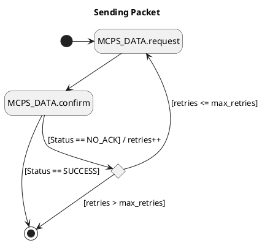
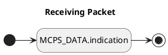

# Architecture

## Functional Requirements

The standard requires us to handle multiple primitives in parallel and interleave their corresponding radio tasks. Some examples:

- "meta-procedures" consisting of several MLME primitives like scanning/association to a PAN or starting a PAN
- multi-step MLME procedures
- parallel ongoing procedures targeting different peers
- retry on NACK
- CSMA/CA (be it the unslotted, slotted or TSCH version)
- shared ingress/egress security/filtering procedures
- stored transactions (indirect transmission)
- ...

Precise timing is an important functional requirement for several aspects of the standard:

- TDMA protocols: beacon-enabled PANs, TSCH, CSL, RIT, ...
- Location and ranging protocols
- Deterministic, possibly isochronous scheduling of data transmission (e.g. for industrial automation or precisely timed measurements over sensor networks)
- ...

## Non-Functional Requirements

We target

- efficient RAM/ROM usage
  - use zero-cost abstractions wherever possible
  - allocate buffers once per frame (i.e. collect head-/tailroom requirements across the whole stack before allocating buffers)
  - allow for small buffers (e.g. ACK)
- flexibility in buffer allocation strategies
  - buffer allocation from any layer of the framework, upper layers and the application
  - efficient allocation of intermediate buffers (fragmentation, control plane buffers, ACKs, ...)
  - buffers from the heap, stack, allocation frameworks like the `heapless` crate, static allocation
- low energy
  - optimize sleep times
  - runtime efficiency
  - high-precision timing to minimize RX time
- safety
  - use the safe Rust fragment wherever possible
  - stable Rust only
  - prove structural and behavioral correctness via static typing where possible
  - implement back-pressure to avoid packet loss under heavy load
  - avoid deadlock (e.g. due to Rx and Tx requirements blocking each other)
  - prioritize traffic to mitigate DoS attacks

## Implementation hints

- Don't keep large local variables across await points.
- Async sub-functions may only be called where they actually model orthogonal sub-state spaces otherwise distinct top-level tasks are to be exposed.
- Don't distinguish between frame representation and frame buffer (zerocopy, RAM efficiency).
- Generic headroom/tailroom info must be available at all spots where packets might be allocated before allocation and without exposing driver or lower-stack details.
- Pass around references to buffers rather than the buffer itself.
- Don't tie buffer or frame livetimes to the livetime of long-lived objects like services, sockets, interfaces or other elements of the network stack.
- Avoid move semantics when it results in copying large pieces of memory.
- Hide resource-intensive features behind feature gates (security, IEs, ...).

## Architectural Approach

The fundamental architectural intuition is that we can make progress by conceiving IEEE 802.15.4 procedures as multi-radio-task sequences running in parallel. Radio tasks are the basic building blocks from which we build all protocol procedures. This works because the radio channel is sequential and shared by definition making radio tasks natural atomic units of work.

Ongoing data transmissions or MAC procedures can be thought of as little asynchronous "state machines" running in parallel. They trigger outgoing tasks via timers or can be triggered via incoming radio events. The scheduler would be the execution engine of these state machines - making progress one atomic radio task at a time. MAC procedures (or meta-procedures) can themselves be layered (as hierarchical state machines) if they make use of orthogonal sub-procedures such as combining several MLME primitives, CSMA/CA or retry on NACK.

The state machine architecture combines well with the async style, as async functions actually _are_ state machines. The approach is amenable to behavioral modeling for improved correctness guarantees.

## High-Level Architectural Building Blocks

### IEEE 802.15.4 Device

Note: The IEEE 802.15.4 standard's notion of a device is not the same as the more restricted notion of a device in smoltcp. We are able to build a smoltcp device adapter on top of an IEEE 802.15.4 device, but not vice versa.

- exposes an abstract API (MLME + MCPS) to the "next upper layer" as defined by the standard
- not coupled to smoltcp, embassy or other high-level frameworks, except for basic Rust embedded HAL APIs
- may be integrated into smoltcp by way of a smoltcp::phy:Device adapter that translates incoming/outgoing packets from/to MCPS primitives
- proxies or directly exposes MLME primitives to the application - possibly through an intermediate management service that implements procedures above MLME (e.g. TSCH PAN formation for coordinators, sending with retry, or scanning/association for end devices)

### MAC service

- handles and produces MLME/MCPS primitives
- contains alternative schedulers (TSCH - and potentially later BE PAN, NBE PAN incl. CSL/RIT, LE, DSME, ...)
  - starts and maintains the main slotframe/superframe loop
  - configured and controlled with MCPS/MLME primitives via the IEEE 802.15.4 device abstraction across an MPSC channel
  - maps primitives to scheduled radio tasks
- implements (TSCH) CSMA/CA
- may be configured to use ACK or not - this is also independent of the scheduler

### MAC PIB and proxy for PHY PIB

Must be mutable from both, the application and the framework. May require locking when accessed from more than one executor.

### Radio Driver Service (formerly: PHY Service)

An interface between the MAC service and drivers:

- keeps track of and executes radio tasks
- manages hardware offloading based on driver capabilities, e.g. ACK and CSMA/CA offloading
- implements common low-level routines that may be re-used across drivers
- configured and controlled by the MAC service across an MPSC channel that queues pending radio tasks

Time sensitive radio tasks need to be placed in an ordered queue inside the MPSC channel. Best-effort radio tasks, i.e. tasks without a timestamp, will have to be placed in a separate queue within the channel. Whenever possible, the radio driver service will pick tasks from the "best-effort" queue to "fill the gap" until a time sensitive tasks needs to be scheduled.

Note: This service is not restricted to or represents the standard's PHY layer as it has to deal with notions from MAC for hardware offloading. The PHY / MAC divide is orthogonal to both, drivers and the driver service. We'll have to ensure proper separation of MAC and PHY concerns inside the drivers and driver service. That's the reason why I propose to remove the PHY abbreviation from its name.

### Low-level Ingress, Egress and Security Procedures

- filtering
- encryption/decryption
- signing
- low-level IFS enforcement

These procedures may be re-used across primitives - even below CSMA/CA and ACK.

The scheduler must account for execution times of these procedures when scheduling radio tasks. The radio driver service must be aware of them as any of them may be offloaded to hardware.

### Radio Driver

- designed around a minimal set of generic low-level radio tasks and offloading hooks
- orthogonal to PHY and MAC, encapsulates radio _hardware_
- may implement/offload MAC-level features for some hardware
- communicates capabilities to the driver service
- does not necessarily implement all PHY procedures, some may be hardware independent and therefore kept in the driver service, e.g. PIB management

## Integration with smoltcp: 6LoWPAN

Currently smoltcp parses/emits full IEEE 802.15.4 frames and receives/sends them from/to the driver. The driver is assumed to be a "dumb" transmitter. This doesn't work in the long run:

- Hardware offloading of MAC-level features as well as several protocol-specific concerns (e.g. inserting IEs, filtering frames) requires us to read/write IEEE 802.15.4 frames within dot15d4.
- MCPS requests/indications obviously receive upper-layer payload and meta-data separately and do all kinds of processing on those before emitting frames. They don't accept structured MAC frames.
- 6lowpan requires access to both, IP headers and IEEE 802.15.4 specific header info (e.g. MAC addresses, PAN, etc.). Therefore _either_ 6lowpan header compression and fragmentation needs to be factored into a separate package below the smoltcp driver API and above MCPS _or_ smoltcp's 6lowpan implementation tightly couples into dot15d4's frame parser/writer to access header info contained in zero-copy buffers.

To avoid redundant frame parser/writer code in smoltcp and dot15d4, the dot15d4 frame parser/writer will be distributed as an independent package that smoltcp can link to w/o depending on the full dot15d4 framework.

# State Machine Model

## Mapping of Building Blocks to State Machines

- Layers/procedures can be mapped to hierarchical state, implemented as nested async functions.
- Parallel interleaved procedures can be mapped to state machine regions with select/join/merge operations
- Radio tasks represent the atomic state machine operation.

We use UML state machine modeling to represent our architecture.

## Implementation of State Machines in Rust

- Behavioral State Machines: typestate
- Protocol State Machines: local and remote session types

Both, behavioral and protocol state machines, can be embedded into event loops inside async functions.

## MPSC State Machine Communication

State machines may be composed via communication channels. This allows us to combine state machines not only vertically (as hierarchies) but also horizontally in an arbitrary net of peers.

We currently assume that N-to-1 state machine communication will be necessary and requires a dedicated MPSC channel design:

- Send/Receive messages may be produced from multiple concurrent application tasks and need to be received by a single MAC-level scheduler state machine. See the corresponding architecture discussion in earlier sections and the state machine design below.
- The scheduler state machine will handle concurrent service primitives in independent state machine regions with sub-state machines. Radio tasks scheduled by these concurrent sub-state machines need to be collected into a single driver task queue.

So far, 1-to-N communication from a single producing state machine to several receiving state machines seems not to be required.

Initial experimentation indicates that existing channel implementations from the dot15d4 or embassy crates cannot be re-used. A non-synchronized, 2-phase (token reservation + message commit) MPSC channel with backpressure was designed instead to fill the gap:

- Other than the existing dot15d4 channel, it decouples message/buffer allocation from message transport, is able to queue a bounded number of requests in parallel and maintains backpressure rather than dropping messages due to limited bandwidth.
- Other than embassy's 2-phase zerocopy channel, it supports multiple producers and allows them to wait for channel capacity without spinning the CPU.

Relevant design choices:

- MPSC communication: Messages sent from concurrent state machines (e.g. application tasks) may be received by a single receiving state machine (e.g. the MAC service).
- Two-Phase Communication: Producers may reserve one or several message slot(s) before trying to send the corresponding messages. Once a slot has been reserved, sending the corresponding message will be infallible. This allows producers to avoid deadlock by postponing resource allocation until the necessary communication bandwidth has been guaranteed to make progress.
- Support for synchronous and asynchronous clients: A synchronous API allows for integration of synchronous clients like smoltcp, an asynchronous API allows for an improved developer experience, easier resource management and request/response communication patterns.
- Backpressure: If the receiver cannot handle produced messages as they arrive, the channel will exert backpressure on fast producers without dropping messages.
- Not synchronized: The current design is not synchronized across threads. This means that currently all producers and the receiver must be driven by the same asynchronous executor. This may have to change in the future, e.g. to place producers and receivers in executors with different execution priorities or to support producing messages from interrupt context.
- Bounded capacity: The channel will offer dedicated message slots, i.e. guaranteed bandwidth, to state machines that act as message producers.
- Bounded Backlog / Waker Registry: A bounded number of producers waiting for message slots is supported. Tasks, waiting for message slots will not be woken up until a slot becomes available.

A typical channel access consists of the following steps:

- An upper layer client task plans the next application transaction in terms of required messages and buffer resources. The MAC and driver backends will expose APIs that allow the upper layer to calculate the required zerocopy buffer space including opaque head- and tailroom requirements for all protocol and driver layers combined.
- The upper layer client task acts as unidirectional message producer - even when receiving messages. It reserves the necessary message slot(s) for all send/receive messages that need to be exchanged _before_ trying to allocate the corresponding buffer resources. Note: This design accounts for the fact that the MAC and driver layers will know about the required buffer sizes but must be agnostic about the buffer allocation strategy (stack, static, heap, custom allocator, ...).
- Once sufficient communication bandwidth has been reserved on the channel, the client task tries to allocate the required buffer resources. As long as all other client tasks reserve message slots before trying to allocate buffer resources, too, deadlock will be avoided.
- In case of an allocation error or timeout, the client task may return the reserved message slots to the channel so that other tasks with lower resource requirements may make progress. In case of success, the client task will use the reserved communication bandwidth to send the allocated messages over the channel.

## Representing Primitives in State Machines

All following state diagrams may contain states representing MLME/MCPS service primitives. The following implicit semantics applies to states named after standard primitives:

- request primitive:

  - trigger: a producer in the next upper layer starts the request
  - entry behavior: the request primitive is transported from the next upper layer to the MLME/MCPS SAP
  - doActivity: the request is executed via radio Tx tasks or other internal means
  - completion event: triggered immediately, as soon as all corresponding radio tasks or other internal activities have been executed, i.e. before a response from a peer device arrives
  - exit behavior: If the request does not have an associated confirm primitive, then the upper layer is being notified that the request has been transmitted (or that the transmission failed).

- confirm primitive:

  - trigger: completion event(s) of one or more associated request primitive(s)
  - entry behavior: n/a
  - doActivity: Schedule Rx tasks to receive results of the associated service request.
  - completion event: all results of the associated request primitive(s) have arrived or a timeout was reached
  - exit behavior: The confirm primitive is transported from the MLME/MCPS SAP to the next upper layer.

- indication primitive:

  - trigger: a producer in the next upper layer starts waiting for indications
  - entry behavior: n/a
  - doActivity: schedule Rx tasks to receive indications or set up and monitor internal event triggers
  - completion event: triggered as soon as an Rx task containing an indication finishes or an internal event triggers
  - exit behavior: the indication primitive is transported from the MLME/MCPS SAP to the next upper layer

- response primitive:
  - trigger: a producer in the next upper layer received an indication that requires a response
  - entry behavior: n/a
  - doActivity: the upper layer producer collects information required for the response. The response is transported from the next upper layer to the MLME/MCPS SAP. If required, Tx tasks will be scheduled to send the response to peers.
  - completion event: all information required for the response has been collected and transmitted (i.e. the corresponding Tx tasks have ended - possibly including their acknowledgment)
  - exit behavior: the upper layer is being notified that the response has been transmitted (or that transmission failed)

## Concurrency of Send and Receive Tasks

Multiple send and receive requests may be ongoing in parallel, e.g. to support concurrent communication with distinct peers in TSCH or fast isochronous transfers that require back-to-back scheduling. Concurrency will allow the scheduler to maximize throughput and optimize latency by ordering send requests and reception windows based on TSCH link availability.

```plantuml
@startuml
state "TSCH-Mode On" as TschOn
state TschOn {
  note top of SendRequest1
  Tx only Task
  end note
  state "Sending Packet" as SendRequest1
  [*] -down-> SendRequest1
  SendRequest1 --> SendRequest1
  SendRequest1 -down-> [*]
  --
  note top of SendRequest2
  Request-Response Task
  end note
  state "Sending Packet" as SendRequest2
  state "Receiving Packet" as Receiving2
  [*] -down-> SendRequest2
  Receiving2 -left-> SendRequest2
  SendRequest2 -right-> Receiving2
  Receiving2 -right-> [*]
  note bottom of Receiving2
  Each send/receive packet state
  consumes a dedicated message slot
  in the MPSC channel.
  end note
  --
  note top of fork
  Parallel Tx and Rx Tasks

  Parallel Tx tasks allow for
  fast, possibly isochronous
  back-to-back scheduling.

  The corresponding Rx task
  will have two parallel
  receiving states allowing
  for fast, isochronous
  back-to-back reception.
  end note
  state "Sending Packet" as SendRequest3
  state "Sending Packet" as SendRequest4
  state fork <<fork>>
  state join <<join>>
  [*] -down-> fork
  fork --> SendRequest3
  SendRequest3 --> SendRequest3
  SendRequest3 --> join
  fork --> SendRequest4
  SendRequest4 --> SendRequest4
  SendRequest4 --> join
  join -down-> [*]
  --
  note top of Receiving5
  Rx only Task
  end note
  state "Receiving Packet" as Receiving5
  [*] -down-> Receiving5
  Receiving5 --> Receiving5
  Receiving5 -down-> [*]
  --
  note top of fork2
  Parallel Rx and Tx Task

  listening for unsolicited reception
  while sending from the same producer
  end note
  state "Sending Packet" as SendRequest6
  state "Receiving Packet" as Receiving7
  state fork2 <<fork>>
  state join2 <<join>>
  [*] -down-> fork2
  fork2 --> SendRequest6
  SendRequest6 --> SendRequest6
  SendRequest6 --> join2
  fork2 --> Receiving7
  Receiving7 --> Receiving7
  Receiving7 --> join2
  join2 -down-> [*]
}
@enduml
```


Note: Send requests do NOT represent MCPS-DATA.request primitives. They are higher level because they encapsulate retry in case of NACK. See the "Sending Data Packets" section below.

## Sending Data Packets




## Receiving Data Packets

To receive data packets, the receiving task will block a message slot with an empty allocated MCPS-DATA.indication packet that the driver and MAC layer may write into.




## MAC Service

Upper Layer - MAC Service interface:

- Consumer of MAC requests with MAC confirmation as response
- Producer of MAC indications with MAC responses as response

MAC Service - Driver Service interface:

- Producer of Radio Tasks (SPSC, queue ordered by timestamp, fire and forget)
- Consumer of Radio Task Results (SPSC, queue ordered by arrival time)

Procedure:

- identify and queue the next 2 Rx links and queue them as RxTasks
- loop:
  - select(radio_task_result_future, mac_future)
    - Either::First(RadioTaskDone) =>
      - RadioTaskDone(RxResult) ==>
        - mark RxTask msg slot as received,
        - identify and queue next Rx task (fire and forget)
        - queue MAC indication with MPDU attached and wait for MAC result,
        - free buffer, drop MPDU
      - RadioTaskDone(TxResult) ==>
        - mark TxTask msg slot as received,
        - if ACK: drop original MPDU
        - if NACK: attach original MPDU to confirmation somehow
        - identify corresponding request and return MAC confirmation
    - Either::Second(MacRequest(DataRequest)) =>
      - identify corresponding Tx link and queue it

## Driver Service

MAC Service - Driver Service interface:

- Consumer of radio tasks
- Responds to radio tasks with radio task results

Procedure:

- Option<next task> = try peek queue(0)
- loop
  - check guard time for next task and return task result if timestamp passed
  - timer_future = timer(next_task)
  - change_in_queue_front = queue.get_future() // ???
  - select(timer_future, change_in_queue_front)
    - Either::First() =>
      - schedule next task and await it to start
      - send radio task result back to MAC (fire and forget)
      - Option<next task> = try peek queue(1)
    - Either::Second(next_task) =>
      - cancel timer
      - timer_future = timer(next_task)
